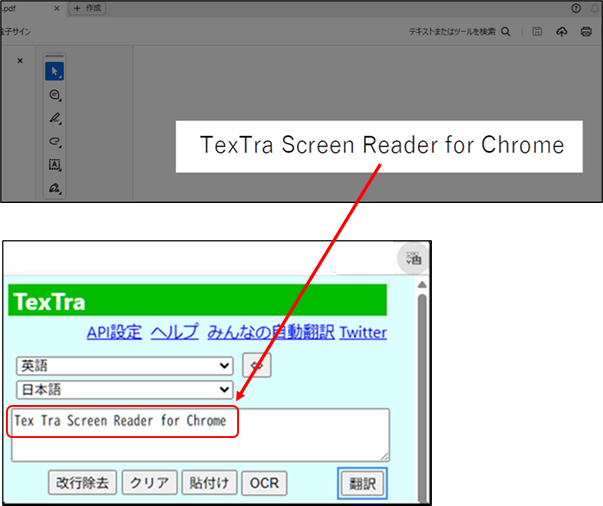
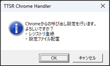
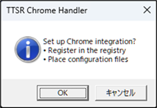

#  TexTra Screen Reader for Chrome

**TexTra Screen Reader for Chrome**は 
ブラウザアプリChromeの拡張「TexTra Chrome」に、 
OCRでWindows上のテキストを取得する機能を追加するアプリケーションです。 

**TexTra Screen Reader for Chrome** is an application 
that works with the Chrome extension "TexTra Chrome" 
and adds OCR-based text capture feature for Windows. 

---

PDFなどからテキストをOCRでChromeへ取り込んで翻訳します。 
Extract text from PDFs and other sources  
and import it into Chrome via OCR for translation. 
  

------

## 📥インストール Install

Installer.msiを 
本画面の「Releases」からダウンロードして実行してください。 
https://github.com/NICT-Dev/TexTra-Screen-Reader-for-Chrome/releases 

インストール後、 
デスクトップにできたショートカットからアプリを１度実行してください。 
このアプリをChromeから呼び出すための設定を行います。 
（設定後はショートカットを削除しても問題ありません。） 
  

ヘルプ 
https://nict-dev.github.io/TexTra-Screen-Reader-for-Chrome/ja/メイン.html

................................................................................................................................................ 
Please download "Installer.msi" 
from "Releases" section of this repository and run it. 
https://github.com/NICT-Dev/TexTra-Screen-Reader-for-Chrome/releases 

After installation,  
please run the application once from the shortcut created on the desktop. 
This will perform the required setup for launching the application from Chrome. 
(You can delete the shortcut after the setup is completed.) 
  

Help 
https://nict-dev.github.io/TexTra-Screen-Reader-for-Chrome/en/メイン.html

------

## 💻 実行環境 System Requirements

64ビット版 Windows 10 または Windows 11 
TexTra Chrome (ブラウザアプリChrome、Edge用の拡張) 
https://github.com/NICT-Dev/TexTra-Chrome

Windows 10 (64‑bit) or Windows 11 (64‑bit) 
TexTra Chrome (browser extensions for Chrome and Edge) 
https://github.com/NICT-Dev/TexTra-Chrome

------
みんなの自動翻訳 
Min'na no Jido Hon'yaku 
https://mt-auto-minhon-mlt.ucri.jgn-x.jp/ 

        